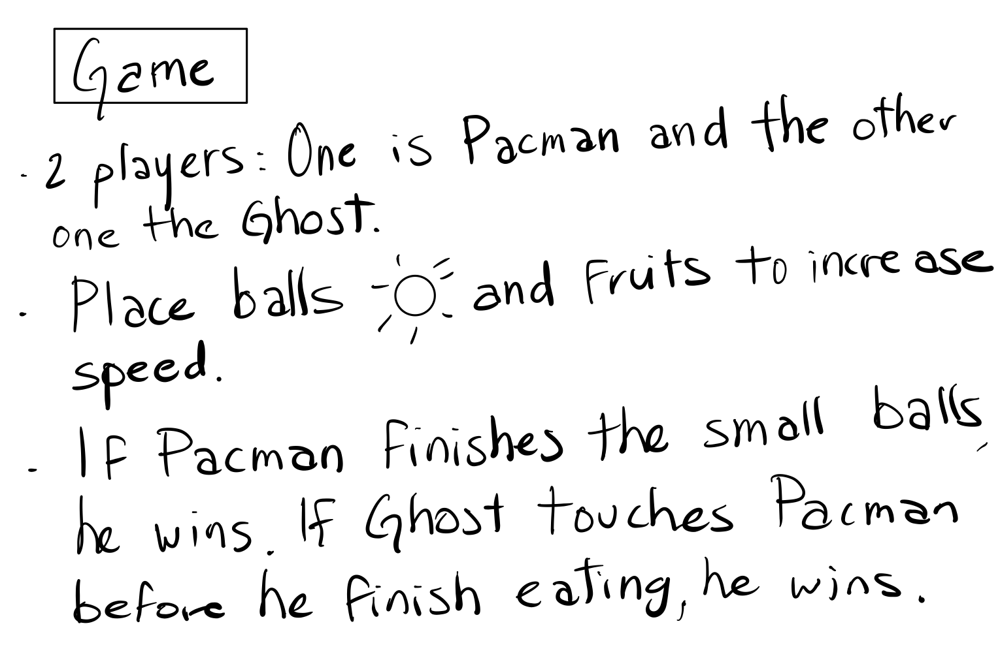
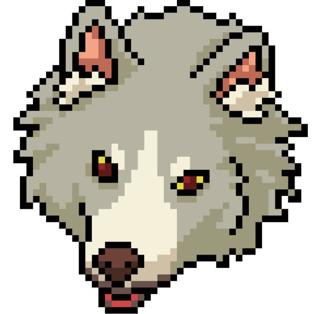
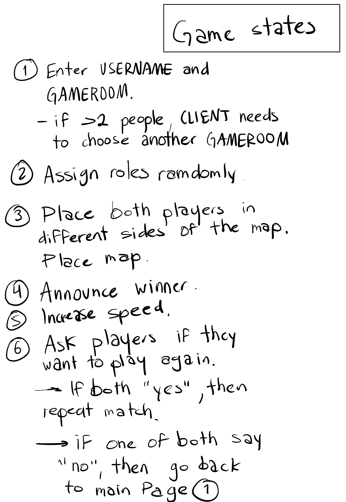
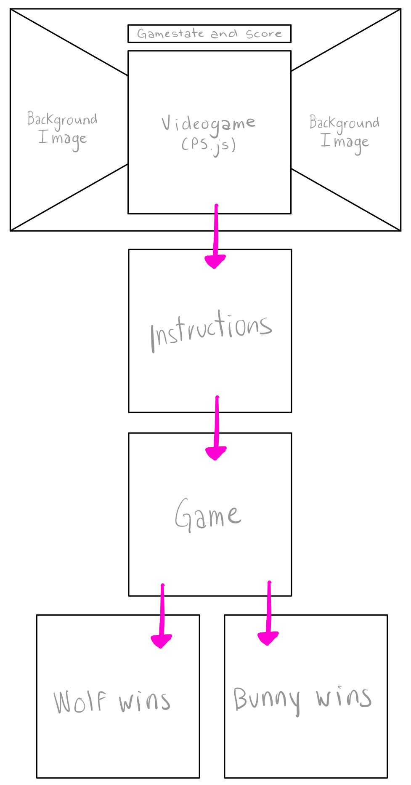
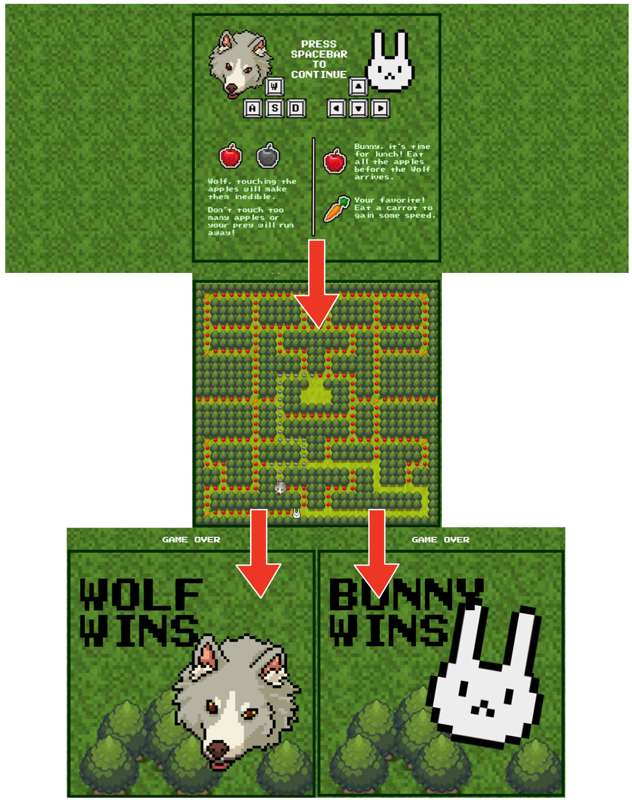

# Howl Are You, Mr. Rabbirt? | Andres' documentation

### Process:

#### First drafts and evolution of the concept: 

My first draft idea was to develop my own version of Skribbl, which is an online game that my friends and I find very entertaining. Nonetheless, I considered that this idea wouldn’t allow me to push my creative and coding skills the way I wanted. For this reason, I decided to move to my second idea, which is to recreate the game of tag on a virtual platform. The game would consist of a player chasing another one by moving the key arrows, having features like the ability to increase the speed and eating items to gain points. This new concept seemed similar to the Pacman videogame, so I found it interesting to try to combine its aesthetics with the concept of my game. 

 

In the beginning, I was working on my own but I started collaborating with Fatema Nassar when we realized that our creative concepts could go along very well. Her animations of leaves falling down gave the forest theme of this game and gave birth to “Howl Are You Mr. Rabbirt?”. 

  

In our unified version, the role of Pacman is represented by a bunny and the ghost by a wolf.

#### Wireframe and final concept:

 

  
