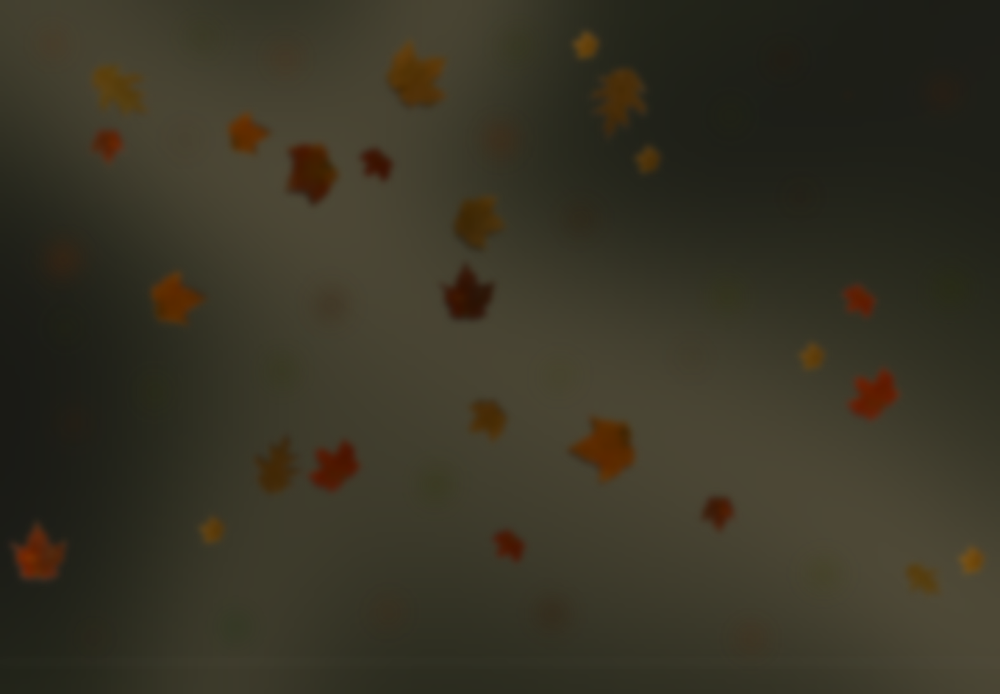
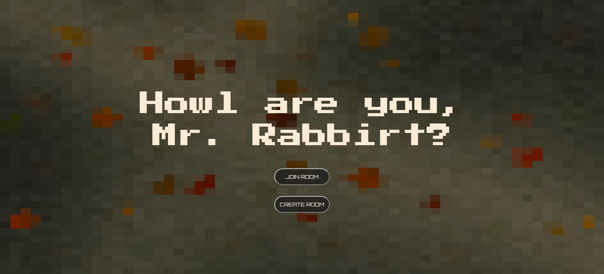
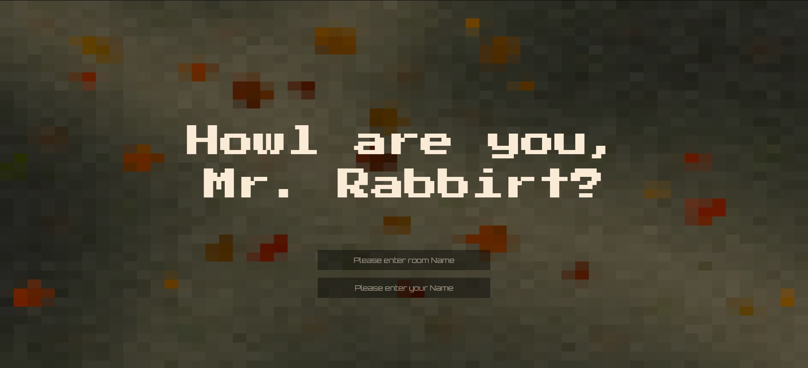

## Fatema

### Description:
I created an interactive landing page for pakman where new user had to choose whether to create a room or join a room. 
If user creates a room they are automatically redirected to that room, and if they  want to join a room, they have to enter their name then choose the leaf for which room they want to join. As they click on the leaf they are redirected to the room name stored in the leaf object.

### Process:

#### Evolution of the concept:
When I first came up with my idea I was planning on something fairly similar to the final result, only I did not keep in mind that we had a week to finish and my part was not that easy to figure out.
I was planning on creating an installation style landing page with either a:
- Simple creative game or connection in the second part of the website
- Or a user input details about themselves and others view it on leaf hover, something like paper planets but more interactive and simpler.
At the beginning, my part of the project had the same setup, but it was a “high resolution” verison of it. 
> i say high resolution between quotes because the low resolution was on purpose.

When I started working with Andres, we wanted to have a similar theme to both parts of the project. So I changed my design to a low pixelated version that gives an old computer vibe just like packman and all the other old computer games.
I also pixelated the leaves I had, and now that I look at it I think it may have used a little bit more pixelation (larger shapes for pixels).
Then i decided to keep my idea of the game but with his game instead.
First background Image looked like this:

Final result:


#### Wireframe and concept:
For the wire frame, I did not change much throughout the process. 
My initial wire frame was the same all along so I will just show the current images with position.


and how it is organised now:

and with one leaf falling


### Major challenges and solutions:
1. My main challenge was time. I had thought initially that I can finish so much more than what I could’ve in the time that we had, that’s why working with Andres helped both of us a lot, as it helped me with what i couldn’t finish and him with finding and creating a new theme that was not copying anyone or anything but his own thought process.
2. My second biggest challenge was that, as a form of exploration, I decided to start by not using `p5.js` for my animation. With sockets however, and generally javascript not being the fastest or the friendliest in displaying new elements, it did not work the way I wanted it to. Even getting it to work was a lot more complicated than I had anticipated. So I decided to change it to p5.js to have a smoother flow and a lot more controle over the leaf movement
  initial process:
  - recursive function to act like draw loop
  ```
  timer = () => {
        socket.emit('newPos', n);
        this.my_time = setTimeout(this.timer, 500);
  }
  ```
  - display loop updates `top` or `left` style of element:
  ```
  if (this.loc.y >= this.g) {
            this.step.y = 0;

            // this.end = true;
        } else {
            this.step.y = 2;
        }
        this.loc.y += this.step.y;
        socket.emit('newPos', this);

        this.div_cont.style.top = this.loc.y + "px";

        this.div_cont.style.left = this.loc.x + "px";
        if (this.end) {
            this.reset();
        }
  ```
3. Third, and last of my main worries, was the socket integration between both pages. As much as creating and sending information was fine, I could not figure out how to choose a player one and a player 2 from the main page.
    1. My idea was (still is) to let the first user enter room details and second user to join by pressing on a falling leaf.
    2. I finally figured it out by separating the the create room and join room instructions and saving a boolean variable `create0_join1 = 1/*or*/0;` each time the user clicks on the create room or join room buttons respectively. That way made it easier to determine the first player from the second player as the window location change was faster than the time it took to set the variable difference.
    solution:
    ```
     document.getElementById('joinn').addEventListener('click', () => {
        if (leavesObj.length > 0) {
            document.getElementById("join_form_div").style.display = "none";
            document.getElementById("main_form_div").style.display = "block";
            create0_join1 = 1;
        } else {
            document.getElementById("join_form_div").style.display = "none";
            document.getElementById("joinerror").style.display = "block";
            document.getElementById("main_form_div").style.display = "block";
            document.getElementById("room").style.display = "block";
            create0_join1 = 0;
        }

    })
    document.getElementById('create').addEventListener('click', () => {
        document.getElementById("join_form_div").style.display = "none";
        document.getElementById("main_form_div").style.display = "block";
        document.getElementById("room").style.display = "block";
        create0_join1 = 0;
    })
    ```
That being said, I faced a lot more little struggles here and there, but those were my biggest ones.
